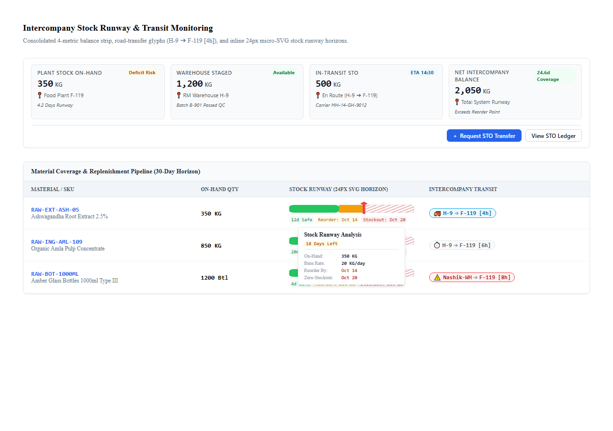
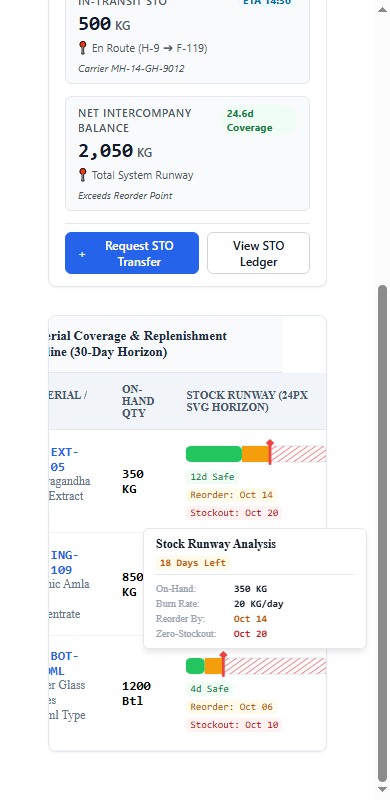
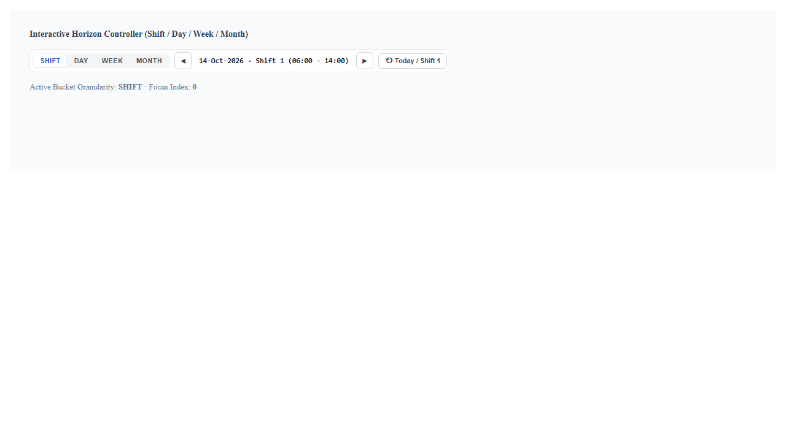
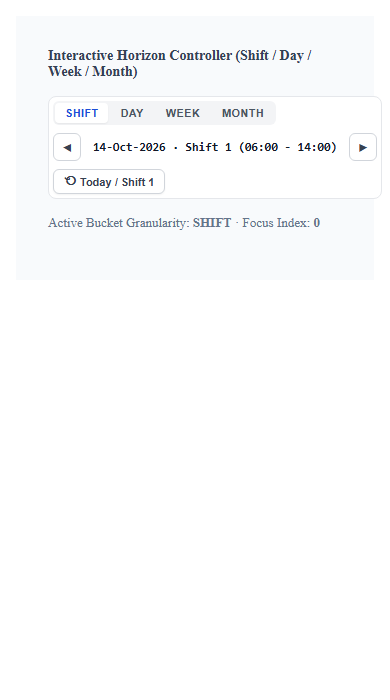

# Horizon controls audit

Audited 3 October 2026 against React Storybook and the React and Angular component source. The original findings remain below as baseline evidence; the priority findings were subsequently resolved.

## Resolution

- Planner runway values remain in days across Shift, Day, Week, and Month views. The workbench now derives reorder dates from its stockout fixture dates and no longer substitutes sample burn rates or dates in component tooltips.
- Both runway implementations derive non-overlapping visible segments from the projected stockout day.
- Both steppers support arrow, Home, and End keys with roving focus; phone targets are 44 px high. The interactive story now shows bucket-specific labels and disables arrows at sample boundaries.
- The stock story uses complete material cards on phones. At medium widths, its table remains horizontally scrollable.
- The React tooltip now links to its focused runway and closes on Escape, matching Angular behavior.

Verified with React and Angular builds, Storybook typecheck and build, and rendered checks at 390 px and 768 px. [Updated phone stepper](after-stepper-mobile.png), [updated phone runway](after-stock-mobile.png), and [focused runway tooltip](after-stock-mobile-focused.png).

## Captured steps

1. **Stock runway, desktop — usable with reservations.** The four KPI cards and three material rows are readable; hovering a runway shows a contained detail tooltip. 
2. **Stock runway, mobile — poor.** The KPI cards stack, but the story's table clips its first columns and the runway is squeezed to its 140 px minimum. The tooltip remains inside the viewport. 
3. **Time stepper, desktop — usable with reservations.** The active bucket and current horizon are visible, but all controls are very small. 
4. **Time stepper, mobile — partial.** The controller wraps to three lines without page overflow; control size and long horizon text remain dense. 

## Baseline technical health

| Dimension | Score / 4 | Evidence |
|---|---:|---|
| Accessibility | 2 | Radio semantics lack radio keyboard behavior; controls measure 20–28 px high; React tooltip is not linked to its focus target. |
| Performance | 3 | Small SVGs and lightweight controls; no significant render cost found in source review. |
| Responsive | 2 | Stepper wraps; the stock story clips material cells at 390 px. |
| Theming | 2 | Both use tokens, but each component uses a different token namespace and fallbacks; dark themes were not verified. |
| Implementation integrity | 1 | The workbench changes day values into shifts, weeks, and months while the runway still labels them as days on a 30-day axis. |
| **Total** | **10 / 20** | **Acceptable; below release standard for planning decisions.** |

## Original findings, in priority order

1. **P1 · Forecast meaning changes with stepper selection.** The Planner Workbench passes `safeDays * 3` for shifts, `safeDays / 7` for weeks, and `safeDays / 30` for months into a component that always describes values as days and defaults to a 30-day horizon. It also omits reorder date and burn rate, so the component's fixed example values appear as operational facts. This can mislead replenishment decisions. Keep forecast data in days, adjust only the displayed time scale, and require real dates and quantities at the integration boundary. Source: `PlannerWorkbench.stories.tsx` around lines 1494–1527; both runway implementations.
2. **P1 · Contradictory runway segments are possible.** An explicit `stockoutDay` may fall before `safeDays + reorderDays`; the reorder rectangle is rendered over the deficit area and hides the red risk zone. Validate the inputs or derive non-overlapping segments from one canonical forecast. Source: React `StockRunwayHorizon.tsx` lines 66–75 and 136–159; Angular counterpart.
3. **P1 · Bucket control promises radio behavior without providing it.** Both frameworks use `radiogroup`/`radio`, but there is no arrow-key handling or roving focus. Users must tab through every option; assistive technology is given an interaction model the component does not support. Implement the radio keyboard pattern or use pressed-state buttons. Source: both `TimeHorizonStepper` implementations.
4. **P1 · Touch targets are too small.** In the captured story, bucket buttons are 20 px high, arrows 28 px square, and Jump is 25 px high. Increase hit areas to at least 44 px on touch layouts and retain visible focus. Source: both `TimeHorizonStepper.css` files.
5. **P1 · Stock story hides material context on mobile.** The table is wrapped in `overflow: hidden`; at 390 px, SKU text is cut off while runway bars remain visible. Use a labeled, horizontally scrollable table or a mobile row layout so the material and its forecast stay together. Source: `StockRunwayHorizon.stories.tsx` around lines 130–193; mobile screenshot.
6. **P2 · Tooltip accessibility differs by framework.** Angular assigns `aria-describedby` and closes on Escape; React shows a portal tooltip on focus but does neither. Link the React tooltip to the focused runway and support Escape. Source: React `StockRunwayHorizon.tsx` and `FloatingDataTooltip.tsx`; Angular `floating-data-tooltip.ts`.
7. **P2 · The stepper story does not prove bucket behavior.** Changing Day, Week, or Month only changes the selected button and a debug line; the horizon label remains a shift label. Boundary arrows also remain enabled while the story clamps the index. Use bucket-specific horizon data and expose disabled boundary states. Source: `TimeHorizonStepper.stories.tsx` lines 25–56.

## Positive findings and limits

The stock tooltip is portal-mounted and was visually contained in both tested viewports. The stepper wraps without horizontal page overflow. Both components include visible focus styles or focus-triggered detail, and the stock animation respects reduced motion.

React Storybook was captured at 1280 px and 390 px. Angular was reviewed in source, not rendered. No screen-reader session, dark-theme capture, automated contrast check, or full performance profile was run. The Impeccable mechanical detector reported no findings on the four component source files; the issues above are verified from screenshots and code behavior.
